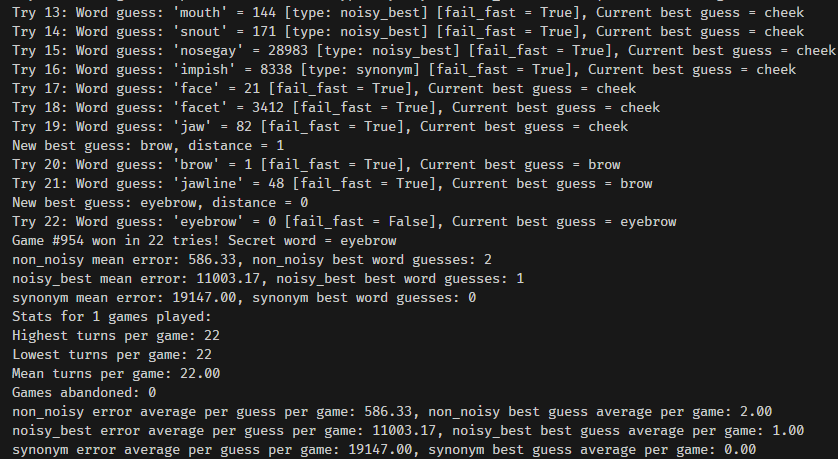

## Contexto.me solver

This is my attempt at a Contexto.me solver.



## Prep

There's a `collect_words()` function for grabbing words from contexto.me. I've already provided the 31520 unique words that were there when I first ran it.  I found the API listed at https://contexto.me/static/js/gameApi.js and grabbed the words 500 at a time. I tried to determine what the full wordlist might be, but after checking the popular ones I kept finding word mismatches, so I settled on using the list I scraped.

Qdrant will need to be running on the local machine, or you can edit the options at the top of the script to connect to your Qdrant instance of choice.

By default 2 Fastembed models will be downloaded: "jinaai/jina-embeddings-v2-small-en" and "jinaai/jina-reranker-v2-base-multilingual"

The nltk WordNet corpus will also be downloaded on first run, but it's small.

run `pip install requests numpy qdrant_client fastembed nltk` to install the requirements.

## Usage

```
python .\contexto.py -h
usage: contexto.py [-h] [-b BENCH] [-g GAME] [-w WORD] [-f] [-r] [-o] [-i] [-d] [-t TEST TEST]

Contexto.me game player

options:
  -h, --help            show this help message and exit
  -b BENCH, --bench BENCH
                        Number of games to benchmark (default: 1).
  -g GAME, --game GAME  Game number to play (0-964) (default: random).
  -w WORD, --word WORD  First word to guess (default: random).
  -f, --fail            Enable fast fail: end current strategy on really bad guess (default: False).
  -r, --rerank          Use reranker model (default: False).
  -o, --opposite        Use opposite word strategy (default: False).
  -i, --init            Delete and re-initialize Qdrant collection (default: False).
  -d, --download        Re-download wordlist and re-initialize Qdrant collection (default: False).
  -t TEST TEST, --test TEST TEST
                        Test shifting the first word closer to the second and print the results (default: None).
```

## Embedding model analysis

After I had my initial code written I noticed that something seemed a little off with the word choices. I was using `BAAI/bge-small-en-v1.5` because it's Fastembed's default, and it's a good default.

I wanted to compare how my embedding model was ordering top words compared to how contexto.me was ordering them.

I played some games, and saved all the words chosen, their vectors, and their contexto.me distance scores.

For each game the list is sorted by contexto score, with 0 (the winner) being at the top.

I then measured the cosine similarity between each word and the winning word.

I left the cosine similarity score in the original position on the list.

If my embedding model is similar to contexto's, then the list of similarity scores should be in exact descending order, from perfect similarity to less similarity.

I'll share the results.
These are from different games, so the results aren't directly comparable.

BAAI/bge-small-en-v1.5:
This is one is pretty bad, 11th place should be 2nd place, etc.
```
sim = 1.0000000000000002
sim = 0.698681926674066
sim = 0.7332759571945617
sim = 0.7078685621752275
sim = 0.7225254216799708
sim = 0.7474668381723699
sim = 0.6970956440426024
sim = 0.6112515723617686
sim = 0.6992173292156687
sim = 0.7759427790178524
sim = 0.8276948081133152
```

sentence-transformers/paraphrase-multilingual-MiniLM-L12-v2 (mean pooling):
Again, kind of all over the place.
```
sim = 1.0
sim = 0.6342452007189077
sim = 0.8254852975401388
sim = 0.7539947768281307
sim = 0.6051754072579477
sim = 0.6453120917628385
sim = 0.6102752399453262
sim = 0.7734193119780349
sim = 0.5095745938746133
sim = 0.6022843057803043
sim = 0.5736919033220919
```

sentence-transformers/paraphrase-multilingual-MiniLM-L12-v2 (CLS pooling):
Imported this as a custom model in fastembed to enable CLS pooling.
Results not improved.
```
sim = 1.0
sim = 0.7337148389783721
sim = 0.6610163609477678
sim = 0.5188550690532175
sim = 0.6025883895855179
sim = 0.4426499707308903
sim = 0.41810479969930125
sim = 0.5358811716168708
sim = 0.4673357264099205
sim = 0.4458347493346856
sim = 0.519994852050964
```

sentence-transformers/paraphrase-multilingual-mpnet-base-v2 (mean pooling):
Also not great.
```
sim = 0.9999999999999998
sim = 0.5705662115058288
sim = 0.6185767223109236
sim = 0.5177030732319637
sim = 0.43603705673650184
sim = 0.5154148533091154
sim = 0.6215337827098149
sim = 0.48845113969426757
sim = 0.514049061332617
sim = 0.4998529098900963
sim = 0.4900078800063112
```

snowflake/snowflake-arctic-embed-m:
Starting to notice a pattern here.
```
sim = 1.0
sim = 0.9563813216808823
sim = 0.9633019962201038
sim = 0.9530258486552889
sim = 0.9584140928185435
sim = 0.9299581082964846
sim = 0.9468156361606535
sim = 0.9355514562733133
sim = 0.9550110331228808
sim = 0.9419708317829345
sim = 0.946459967720367
```

BAAI/bge-small-en:
Meh.
```
sim = 1.0
sim = 0.8760868224074594
sim = 0.851366500120793
sim = 0.8312005205100261
sim = 0.8697596792539628
sim = 0.8531780260241337
sim = 0.8575056719137308
sim = 0.8523944830786702
sim = 0.8471913730626061
sim = 0.8410292434827897
sim = 0.80233962559004
```

sentence-transformers/all-MiniLM-L6-v2:
I had high hopes for this one because it's 3+ years old and well-loved.
```
sim = 1.0000000000000002
sim = 0.4830953631547022
sim = 0.47568995124234104
sim = 0.44270779798940263
sim = 0.3732925739072864
sim = 0.48289691084429726
sim = 0.3273567657099126
sim = 0.5187057277317101
sim = 0.4378254150022406
sim = 0.4218050344860489
sim = 0.5253598134598766
```

jinaai/jina-embeddings-v2-small-en:
I had given up hope on newer models, but this is an okay result.
the 0.85 near the bottom could be shifted up some places, but otherwise it seems mostly sane.
```
sim = 1.0000000000000002
sim = 0.8786870108907178
sim = 0.87259651142474
sim = 0.8665212652802259
sim = 0.8543963446425961
sim = 0.8554951640647075
sim = 0.8432604565354676
sim = 0.821387202229581
sim = 0.8213115763409468
sim = 0.8505722423130078
sim = 0.8005008626648253
```

I decided to stick with `jinaai/jina-embeddings-v2-small-en`.  I could maybe eventually track down the exact model, but for now this will be good enough. If I wanted to track down the exact model some clues to help are: archive.org shows contexto.me being around 3 years old in it's current form. It's also a multilingual game.

## Strategies used

Initial strategy = pick random words until the score is below 2000. Not very sophisticated =)

For each turn select query vector from these choices:

- "non_noisy" = This is what I call the vanilla vector similarity search. Just look for words near the best guess.

- "noisy_mean" = Pick randomly between 2nd, 3rd, 4th best guess. Take the mean of it's vector and best guess' vector, add in some Gaussian noise and renormalize the result. Look for unguessed words near this vector.

- "noisy_best" = Take the vector of the best guess, add some Gaussian noise and renormalize. Look for unguessed words near this vector.

- "move_vec" = Pick randomly between 2nd, 3rd, 4th best guess. Shift the vector towards the best guess. Look for unguessed words near this vector.

After N bad guesses in a row, select from these strategies:

- "opposite" = If this strategy is enabled, pick randomly from the bottom 3 worst guesses. Search through vector cache and calculate cosine similarity between this guess and every word in the wordlist.  Select the worst match and look for unguessed words near this vector.

- "synonym" = Use NLTK + WordNet to get the synonyms for the current best guess. Look for unguessed words near those synonyms.

Optional strategies:

- "opposite" above

- "fast_fail" = If a guess' distance is beyond the set threshold, immediately abandon the current strategy.

- reranker = enable the reranking model. Not sure how much impact it has. I decided against including other additional models after my model comparison above. I'm not sure how well they would match up to contexto's own distance metric.

Strategy to help the solver get unstuck:

- After returning from every strategy, if more than 25 tries have passed since last random word, try a random word.

## Example of shifting one word closer to another

```
python .\contexto.py -t green house
Collection 'contexto' already exists, skipping init.
31520 points in collection.
top 10 results closest to green:
green, greenish, greenies, greening, greenback, colored, greene, greenery, color, greengrocer
------------------------------------------------------
top 10 results closest to new vector:
green, house, greenback, greenery, greenish, greenies, greenhouse, greening, garden, greene
```

## Statistics

Each run produces per-game and per-run metrics.

Here's an example of running a 1 game benchmark:

```
noisy_mean mean error: 12486.57, noisy_mean best word guesses: 0
noisy_best mean error: 5758.12, noisy_best best word guesses: 1
opposite mean error: 59076.00, opposite best word guesses: 0
synonym mean error: 7167.00, synonym best word guesses: 0
move_vec mean error: 5823.75, move_vec best word guesses: 0
Stats for 1 games played:
Highest turns per game: 36
Lowest turns per game: 36
Mean turns per game: 36.00
Games abandoned: 0
noisy_mean error average per guess per game: 12486.57, noisy_mean best guess average per game: 0.00
noisy_best error average per guess per game: 5758.12, noisy_best best guess average per game: 1.00
move_vec error average per guess per game: 5823.75, move_vec best guess average per game: 0.00
synonym error average per guess per game: 7167.00, synonym best guess average per game: 0.00
opposite error average per guess per game: 59076.00, opposite best guess average per game: 0.00
```

Per-game metrics are at the top. To get the error for each word guess I subtract the current guess' distance from the best guess' distance. So if a guess is a new best guess, the error for that strategy goes down. Otherwise it goes up. I then add that to the total error for that strategy, and I keep track of how many times each strategy is used.

Per-run metrics (i.e. for multiple games) are just divided by the total games.  However, not every game uses every strategy, so to keep it accurate I also keep track of which strategies each game actually uses.

Best word guess metrics are just how often each strategy picked a new best guess.

## How to improve?

If I were to continue looking at this I would probably convert & test more sentence-transformers models. Contexto.me is multilingual and has been around for a few years, so that should give me a hint regarding the models to look at.

I just realized after writing this that I don't have a deterministic mode that can be enabled for comparing various options. Adding in optional determinism would be nice for comparing strategies.

## Performance

It doesn't seem terribly great? Some games are solved in 20 guesses, others in 200. Sometimes there are very bad games and it's difficult to get the game unstuck. I haven't run a big benchmark yet, but if I do I'll post the stats here.

Stats for 100 games, opposite on, reranking off:

```
Stats for 100 games played:
Highest guesses per game: 4076
Lowest guesses per game: 37
Mean guesses per game: 476.13
Games abandoned: 0
non_noisy error average per guess per game: 8049.50, non_noisy best guess average per game: 1.28
noisy_mean error average per guess per game: 11259.48, noisy_mean best guess average per game: 2.03
noisy_best error average per guess per game: 13088.42, noisy_best best guess average per game: 1.75
move_vec error average per guess per game: 12107.91, move_vec best guess average per game: 1.62
synonym error average per guess per game: 17208.26, synonym best guess average per game: 0.49
opposite error average per guess per game: 23891.71, opposite best guess average per game: 0.44
```
-----------

Stats for 100 games, opposite off, reranking on:

```
Stats for 100 games played:
Highest guesses per game: 2099
Lowest guesses per game: 24
Mean guesses per game: 348.36
Games abandoned: 0
non_noisy error average per guess per game: 7003.48, non_noisy best guess average per game: 1.09
noisy_mean error average per guess per game: 9109.68, noisy_mean best guess average per game: 2.02
noisy_best error average per guess per game: 11436.08, noisy_best best guess average per game: 1.86
move_vec error average per guess per game: 10970.91, move_vec best guess average per game: 1.32
synonym error average per guess per game: 15436.34, synonym best guess average per game: 1.01
```